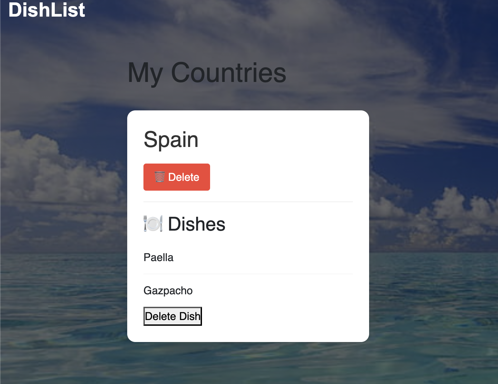

 # Dishlist  App


Dishlist is a MERN-stack single-page application that allows users to record and track the countries they have visited and the dishes they’ve tried. This app serves as a personal memory journal where users can add, update, and explore the dishes they’ve experienced during their travels. Users can store their travel memories, complete with dish names and cooking instructions, and return to them at any time.


 ## Table of contents


* Features
* Technologies Used
* Installation
* Usage
* Backend Functionality
* Screenshots
* Deployment
* License


 ### Features

Add Countries and Dishes:

Users can add a country and the dishes they tried during their visit.
Each entry includes the country name, dish name, and detailed recipe instructions.

* Interactive Journal:
A personalized memory journal that tracks countries and dishes you’ve visited.
Search for specific countries and dishes to recall travel experiences.
* Manage Entries:
Edit or delete country and dish entries.
Keep track of dishes you’ve enjoyed or want to try in the future.
Seed Data:

The app comes with pre-defined seed data that can be used to quickly populate the database with sample countries and dishes.
This feature is ideal for testing or for users who want to see sample entries before adding their own.

* Polished and Responsive UI:

Clean, user-friendly interface optimized for desktop and mobile devices.
User Authentication:

* Secure login and signup with JWT to keep your memory journal private.
Users can create, save, and manage their own entries.
* Error Handling:

Displays error messages if no results are found or if an issue occurs with the API request.
   

 ## Technologies used
   
**Frontend**
- React
- Apollo Client (for GraphQL queries)
- Bootstrap (for styling)
- CSS Styling

**Backend**

- Node.js
- Express.js
- GraphQL (for querying country and dish data) using Apollo server
- JWT (for authentication)
- bcrypt js for password hashing and comparison.


**Database**

- MongoDB
- Mongoose ODM

**Other Tools**

- GitHub Actions for CI/CD
- Render for deployment


 ## Installation

1. Clone the repo

```
git clone https://github.com/lekshmisree89/Travel-pins.git

```


2. Navigate to the project directory:

```
 cd travel-pins

 ```

 3. Install dependencies for both client and server:

```
npm install

 ```
 
 4. Set up environment variables in the .env file

 *Add the following keys:*

```
MONGODB_URI=your_mongodb_connection_string
JWT_SECRET=your_secret_key

```


5. Start the application:
```
npm run start:dev

```


 ## Usage

 ### 1.Register or Log In:
 
This feature allows users to either create a new account or log in to an existing one in order to access their personalized journal  By having an account, users can store, edit, and retrieve their travel experiences (such as countries visited and dishes tried) across multiple sessions.

#### Functionality:

***Registration:***

* Users can sign up by providing a username, email, and password.
* The app will validate the input to ensure that the email format is correct and that the password meets certain security criteria (e.g., minimum length, special characters).
* Once the user’s information is validated, the app will hash the password for security and store the user details in the database.
*After a successful registration, the user will be automatically logged in and directed to their saved page.


***Login:***

  * Users who already have an account can log in using their registered email and password.

  * Upon successful login, a JWT (JSON Web Token) will be generated and returned to the user. This token will be used for authentication and authorization on subsequent requests to the backend.
  * If the user provides incorrect credentials, an error message will be     displayed, prompting them to try again.


***JWT Authentication:***

* Once logged in, the user’s authentication state is maintained using JWT.
* The token is stored in the client-side application (usually in localStorage or sessionStorage).
* The JWT is included in the header of API requests to authenticate the user and retrieve their personal data securely.


### 2.Explore Page Functionality

The Explore Page allows users to search for and explore dishes from different countries. This page acts as the main interface for discovering and adding dishes to their journal.

Key Features:
Search for Dishes by Country:

The page features a search bar where users can enter the name of a country (e.g., "Italy", "Mexico").
As the user types in the search box, the app uses a GraphQL query to fetch a list of dishes from the selected country, displaying them on the page.
If no dishes are found for the entered country, the user will be shown a message indicating no results were found.
Displaying Dishes:

Once a country is entered and the data is retrieved, the user can see:
Country Name: The name of the country the dishes belong to.
List of Dishes: The names of dishes associated with the country.
Instructions: Detailed cooking instructions for each dish.
This information helps users explore the culinary offerings of the country they've searched for.

Error Handling:

If there’s an issue with the API request (e.g., invalid country name or no results), an error message will be displayed, letting users know something went wrong or that no dishes were found for that country.
Interactive Search:

The search field is interactive. As the user types, the list of results updates in real-time (after a successful query), making it easier to explore different countries and their dishes.
Add Dishes to Saved List:

The user has the option to save dishes they like by clicking an "Add to Saved Dishes" button (or similar action).
This action will trigger the functionality to store the dish data (e.g., country, dish name, and instructions) in the Saved Dishes section of the app, making it easy for users to keep track of their favorite dishes.

Example Usage:
A user opens the Explore Page and types "Italy" in the search box.
The app fetches a list of Italian dishes, such as Pasta, Pizza, and Risotto.
The user can view the cooking instructions for each dish and add them to their saved list by clicking on a save button.


### 3.Saved Dishes Page Functionality

The Saved Dishes Page provides users with a place to view and manage dishes they have saved during their exploration. This page acts as a personalized collection of dishes they are interested in or have already tried.

Key Features:
Display Saved Dishes:

The page will show a list of all dishes the user has saved from the Explore Page.
Each saved dish will display:
Dish Name: The name of the dish.
Country: The country the dish is associated with.
Instructions: The recipe or cooking instructions for the dish.

Remove Dishes from Saved List:

The user can delete dishes from their saved list if they no longer want to keep them.
A "Remove" button will be available next to each saved dish, which allows the user to delete the dish from their saved list. This will update the backend and remove the dish from the user's personalized collection.
Persistent Data:

The saved dishes are stored in the database (using MongoDB), so users can access their saved dishes even after logging out and back into their account.
This ensures that the dishes they’ve saved are available across sessions.
Error Handling:

If there’s an issue while retrieving the saved dishes (such as a server error), an appropriate error message will be displayed to the user.
User-Friendly Interface:

The page is designed to be intuitive and easy to navigate, with clear buttons to manage saved dishes and simple, readable lists of dish information.


Backend Description for Explore and Saved Dishes Pages
Explore Page:

When a user searches for a country, the GraphQL query is sent to the backend.
The query fetches dishes for that specific country, and the data is returned to the frontend.
If the country doesn't exist or there is an error with the query, the backend will return an error message, which the frontend will display.
Saved Dishes:

For saving dishes, the backend needs to accept requests that store the dish data in the database.
Each saved dish is associated with the authenticated user via their user ID, ensuring that dishes are saved to the right user account.
When a user removes a dish from their saved list, the backend deletes the corresponding entry from the database.


 
 ## Backend functionality

 
 1. User Model:

 * The backend will have a User model created using Mongoose for MongoDB.
 * The model will include fields like email, username, password (hashed), and any other necessary user-related information.


2. Registration Endpoint:

* The POST request to /api/auth/signup  will allow users to sign up.
* The request will include username, email, and password.
* If the email is not already in use, the server will hash the password and store the user’s details in the MongoDB database.
* The response will include a success message, and the user will be logged in automatically by generating and returning a JWT token.

3. Login Endpoint:

* The POST request to /api/auth/login will authenticate users.
* The request will include email and password
* The server will check if the email exists and compare the provided password with the stored hashed password using the comparePassword method.
* If the credentials are correct, the server will return a JWT token, which the client will use to authenticate subsequent requests.
* If the credentials are incorrect, an error message will be returned.

4. JWT Token:

* The JWT token will be signed using a secret key stored in environment variables (.env).
* The token will be passed back to the client upon successful login and registration. The client will store this token (e.g., in localStorage or sessionStorage).
* On every subsequent request that requires authentication, the client will send this token in the Authorization header.

5. Protected Routes:

* Certain routes (e.g., fetching and managing the user's info adding/editing country and dish entries) will be protected by authentication.
* The server will validate the JWT token passed in the Authorization header of incoming requests using a middleware.
* If the token is valid, the user will be able to interact with the protected routes. If the token is invalid or expired, an error will be    returned.

## Screenshots


[alt text](image-1.png)




## deployment link

HERE IS THE LINK TO  THE DEPLOYED APPLCATION ON RENDER 
https://travel-pins.onrender.com


## Git repo link
https://github.com/lekshmisree89/Travel-pins


